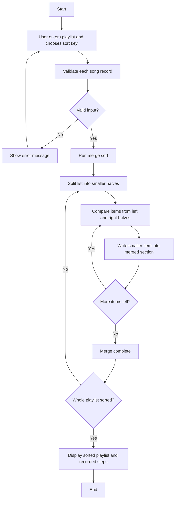

# Playlist Vibe Builder - Merge Sort Visualizer

## Chosen Problem
This project solves the **Playlist Vibe Builder** problem from the course project options. The app lets a user enter songs with a title, artist, energy score, and duration, then sort the playlist to build a different listening vibe.

## Chosen Algorithm
I chose **Merge Sort** because it works well for ordering a list of song records by one selected key such as **energy** or **duration**. Merge Sort is also a strong fit for visualization because the app can clearly show how the playlist is repeatedly split into smaller pieces and then merged back together in order. Since Merge Sort is stable, songs with equal values keep their relative order, which is helpful when several songs have the same energy or duration.

### Why this algorithm fits the problem and dataset
- The dataset is a list of songs, and each song has multiple attributes.
- The user picks one sorting key at a time, so the algorithm compares songs using that one field.
- Merge Sort is efficient for larger lists and easy to explain step by step.
- The merge process makes the movement of songs easier for a beginner to follow than a more chaotic partition-based process.

### Assumptions and Preconditions
- Every song must include `title`, `artist`, `energy`, and `duration`.
- `energy` must be an integer from 0 to 100.
- `duration` must be a positive integer number of seconds.
- The user does **not** need to enter data in sorted order already.

### How the app enforces/checks them
- The app validates each line of input.
- If a line is missing fields or contains invalid numbers, the app shows a helpful error message.
- The app only sorts after the input passes validation.

### What the user sees during the simulation
- A **playlist visualization** using boxes for songs.
- During a comparison step, the compared songs are highlighted.
- During a write-back step, the song being placed into the merged section is highlighted.
- A step table explains each comparison and placement in plain language.

## Demo
Add your screenshot, GIF, or short video here before submitting.

Suggested caption:
> Example run sorting the playlist by energy. The app shows the first highlighted comparison, a full step table, and the final sorted playlist.

## Problem Breakdown & Computational Thinking

### Decomposition
- Read the playlist input from the user.
- Convert each line into a song record.
- Validate the fields.
- Run merge sort on the list using the selected key.
- Record comparisons and placements for the visualization.
- Show the sorted playlist and the step-by-step explanation.

### Pattern Recognition
- The same pattern happens over and over:
  - split the list into smaller halves,
  - compare the first items of two halves,
  - place the smaller one into the merged result,
  - repeat until the halves are merged.

### Abstraction
Shown to the user:
- which songs are being compared,
- which song is being placed into the merged section,
- the final sorted playlist.

Hidden from the user:
- low-level Python details,
- internal recursion bookkeeping,
- unnecessary temporary variable details.

### Algorithm Design (Input → Process → Output)
- **Input:** playlist lines and sorting key from the Gradio interface.
- **Process:** validate data, run merge sort, record steps, build visualization.
- **Output:** sorted playlist, summary, highlighted visualization, and step table.

### Flowchart


## Steps to Run
1. Make sure Python 3.10+ is installed.
2. Install dependencies:
   ```bash
   pip install -r requirements.txt
   ```
3. Run the app:
   ```bash
   python app.py
   ```
4. Open the local Gradio link shown in the terminal.

## requirements.txt
This project uses:
- gradio

## Hugging Face Link
Add your deployed Hugging Face Space link here before submission.

Example format:
- `https://huggingface.co/spaces/your-username/playlist-vibe-builder`

## Testing & Verification
I tested the following cases:

| Test Case | Example Input | Expected Result | Actual Result |
|---|---|---|---|
| Normal case | 6 songs, sort by energy | Songs sorted from lowest to highest energy | Passed |
| Normal case | 6 songs, sort by duration | Songs sorted from shortest to longest duration | Passed |
| Equal values | Two songs with same energy | Stable order should be preserved | Passed |
| Single song | 1 song only | Same song returned unchanged | Passed |
| Empty input | No songs | Error message shown | Passed |
| Invalid format | Missing one field on a line | Error message shown | Passed |
| Invalid energy | Energy below 0 or above 100 | Error message shown | Passed |
| Invalid duration | Duration is 0 or negative | Error message shown | Passed |

### Example edge cases
- one-song playlist,
- repeated energy values,
- invalid numeric input,
- blank lines.

## File Structure
```text
app.py
requirements.txt
README.md
```

## Author & AI Acknowledgment
Author: [Your Name Here]

This project was created for CISC 121. I used AI tools for brainstorming, explanation support, and drafting documentation/code structure, then reviewed and edited the final work before submission.

## Notes for Submission
Before submitting on OnQ, replace the placeholders with:
- your name,
- your GitHub repository link,
- your Hugging Face app link,
- at least one screenshot/GIF/video of the app running.
